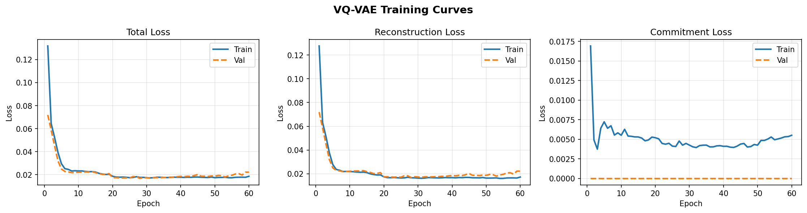
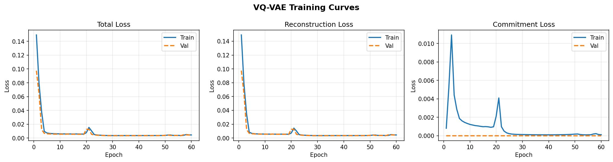
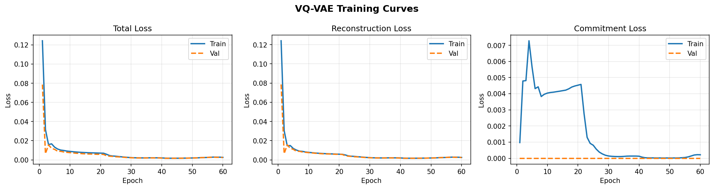
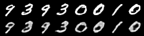
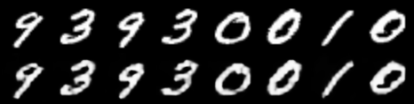
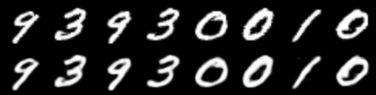
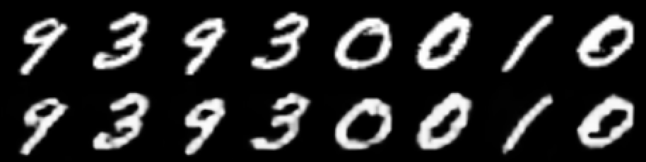
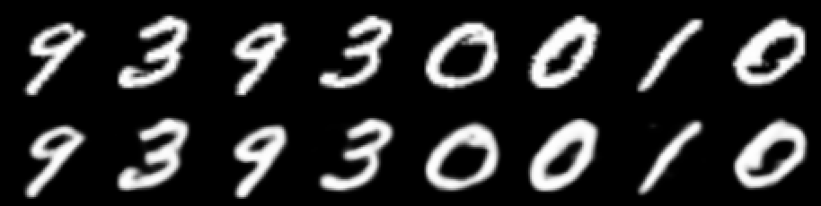

# Results of VQ-VAE reconstruction in MNIST

This section compares the reconstruction performance of a standard Convolutional Neural Network (CNN) against a Fourier Neural Operator (FNO) based VQ-VAE architecture.

## Baseline Reconstruction

| CNN (9k Parameters) | FNO (5k Parameters) | FNO (100k Parameters) |
| :---: | :---: | :---: |
|  |  |  |
|  |  |  |

***note: for all reconstruction results, the first row is ground truth, and the second row is the reconstructed result.***

## Zero-Shot Super-Resolution with FNO

The Fourier Neural Operator (FNO) learns a grid-invariant mapping between continuous function spaces. This continuous formulation enables **zero-shot super-resolution**. While the standard VQ-VAE encoder operates on a discretized grid (28x28 MNIST), the FNO decoder can reconstruct the latent vector directly onto a higher-resolution mesh without retraining.

In the visualizations below, the model (trained on $28 \times 28$) is evaluated with `output_size=56`. To visualize this comparison effectively, the validation script performs the following operations:

* **Row 1 (Top): Bilinear Ground Truth** – The original low-resolution ($28 \times 28$) ground truth is **upsampled** to $56 \times 56$ using standard bilinear interpolation. This is strictly to enable visual comparison and to match the tensor dimensions for saving the single comparison image. This row represents the baseline blurry result of traditional interpolation.
* **Row 2 (Bottom): FNO Super Resolution** – The output directly generated by the Mesh-Invariant FNO decoder at $56 \times 56$ resolution.

This comparison highlights that the FNO decoder generates smoothed details (sharper edges) that are missing from the bilinearly upsampled ground truth, proving it is learning the true function shape, not just an interpolated grid.

| FNO (5k Parameters) - Super Resolution ($56 \times 56$) | FNO (100k Parameters) - Super Resolution ($56 \times 56$) |
| :---: | :---: |
|  |  |
# VQ-VAE Architecture and Training Notes

## 1. Quantization and Decoding
* $z_e(x) \in \mathbb{R}^D$
* $z_q(x) = e_k \text{ where } k = \text{argmin}_j \|z_e(x) - e_j\|_2$
* $\text{decode} \rightarrow \bar{x}$

## 2. The Zero-Gradient Problem
> **Note:** The $\text{argmin}$ operation is non-differentiable on a discrete space:

* $z_q = f(z_e) = e_k$
* $f(z_e + \epsilon) = e_k$
* $\frac{\partial z_q}{\partial z_e} = \lim_{t \to 0} \frac{f(z_e + t) - f(z_e)}{t} = \frac{0}{t} = 0$

## 3. Straight-Through Estimator (STE)
To bypass the zero-gradient issue, the Straight-Through Estimator (STE) is used:

* $z_q = z_e + sg[z_q - z_e]$
* $\frac{\partial z_q}{\partial z_e} = 1 \text{, so } \frac{\partial L}{\partial z_e} \approx \frac{\partial L}{\partial z_q} \cdot 1$

## 4. How to Build a Codebook & Update
The codebook is defined as $C = \{e_1, e_2, \dots, e_K\}$

### 4.1 Initialization
* **4.1.1. Random:** $e_i \sim \mathcal{N}(0,1)$ or $e_i \sim \mathcal{U}(-\frac{1}{K}, \frac{1}{K})$
* **4.1.2. k-means:**
    * $Z_e = \{z_e(x_1), z_e(x_2), \dots, z_e(x_B)\}$
    * $e_i = \frac{1}{|S_i|} \sum_{z_e \in S_i} z_e$

### 4.2 Update Methods
#### 4.2.1 Gradient Descent:
* Objective: $\|sg[z_e(x)] - e_k\|_2^2$
* $\frac{\partial \mathcal{L}}{\partial e_k} \approx -2(sg[z_e(x)] - e_k)$
* $e_k^{(t+1)} = e_k^{(t)} + 2\alpha(z_e(x) - e_k^{(t)})$

#### 4.2.2 EMA (Exponential Moving Average):
* $m_i = \sum_{z_e \text{ snapped to } e_i} z_e$
* $N_i^{(t)} = N_i^{(t-1)}\gamma + (1-\gamma)n_i$
* Where $n_i$ is the number of times codebook vector $e_i$ was chosen.
* $m_i^{(t)} = \gamma m_i^{(t-1)} + (1-\gamma)m_i$
* $e_i^{(t)} = \frac{m_i^{(t)}}{N_i^{(t)}}$

## 5. Loss Functions

The total objective function is a combination of the reconstruction loss and the commitment loss.

$$\mathcal{L}_{total} = \mathcal{L}_{recon} + \beta \mathcal{L}_{commit}$$

* $\beta \rightarrow$ often set to $0.25$

### 5.1 Reconstruction Loss
Measures how well the decoder can reconstruct the original input from the quantized latent vector.

$$\mathcal{L}_{recon} = \|x - \tilde{x}\|_2^2$$

### 5.2 Commitment Loss
Forces the encoder to commit to a codebook vector, preventing the continuous latent space from growing arbitrarily.

$$\mathcal{L}_{commit} = \|z_e(x) - sg[e_k]\|_2^2$$
